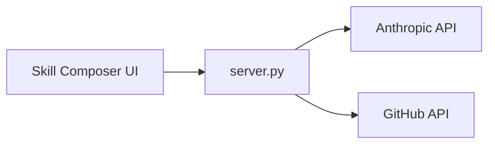

<div align="center">

# Skill Composer

### The fastest path from idea → spec-compliant Agent Skill → GitHub PR

**Create, validate, test, and publish** skills for [Claude](https://claude.ai/), [Cursor](https://cursor.com/), [Claude Code](https://code.claude.com/), and every agent that speaks the [Agent Skills](https://agentskills.io/home) open format.

<br />

[](https://agentskills.io/specification)
[](https://www.python.org/)
[](e2e/)

[Get started](#get-started) · [7-step flow](#the-seven-step-flow) · [Contribute upstream](#contribute-to-anthropicsskills) · [Specification](https://agentskills.io/specification)

</div>

> **Note:** Skill Composer helps you **author** skills that follow the [Agent Skills specification](https://agentskills.io/specification). For Anthropic’s reference implementations and examples, see **[anthropics/skills](https://github.com/anthropics/skills)** on GitHub.

---

## What is Skill Composer?

**Skill Composer** is a local web app that turns plain-language intent into a production-ready skill folder—without opening your editor or running `git` on the command line.

Describe what you want. Get a draft `SKILL.md`. Refine it in a built-in IDE with AI assist. Validate against the spec. Open a pull request to your fork—or **update an existing PR** after review comments—all through the [GitHub API](https://docs.github.com/en/rest).

```text
my-skill/
├── SKILL.md          # Required — name, description, instructions
├── references/       # Optional — REFERENCE.md, docs
├── evals/            # Optional — evals.json, README
├── assets/           # Optional — templates, fonts, samples
├── procedures/       # Optional — step-by-step .md
└── agents/           # Optional — sub-agent instructions
```

Same shape the ecosystem expects. Same standard [Cursor](https://cursor.com/docs/context/skills), [Claude Code](https://code.claude.com/docs/en/skills), and [GitHub Copilot](https://docs.github.com/en/copilot/concepts/agents/about-agent-skills) already load.

---

## Why Skill Composer?

Agents are powerful—but they need **structured, portable context** to do specialized work reliably. The [Agent Skills](https://agentskills.io/home) format packages that context. Skill Composer packages the **authoring workflow**:

| | |
|---|---|
| **Domain expertise, faster** | Go from a one-paragraph brief to a complete `SKILL.md` with frontmatter, examples, and guardrails—AI-assisted, spec-aware. |
| **Repeatable quality** | Built-in validation catches missing `name`/`description`, layout issues, and common spec mistakes before you push. |
| **Ship to the community** | Target **[anthropics/skills](https://github.com/anthropics/skills)** or your org’s fork: new branch + PR, or upsert files on an open review branch. |

**Progressive disclosure, end to end:** discover skills in the catalog → activate by editing `SKILL.md` → execute by pushing artifacts agents can load.

---

## The seven-step flow

```text
  Setup ──► Create / Load ──► Validate ──► Review ──► Test ──► Push ──► Install
    │            │               │            │          │        │         │
  once       generate or      spec         Monaco    smoke     PR to    how others
  config     load from PR     checks       + AI      test      GitHub   install
```

| Step | What you do |
|------|-------------|
| **1 · Setup** | Optional GitHub token (only for push), fork/upstream repos, skills path, optional skill catalog upload |
| **2 · Create / Load** | **Create** from a description, or **Load** an existing skill from a branch or PR |
| **3 · Validate** | Run checks aligned with [agentskills.io](https://agentskills.io/specification) |
| **4 · Review** | Edit `SKILL.md`, supporting files, and evals in the IDE—**this is where content changes** |
| **5 · Test** | Quick in-browser prompt test; guidance for local install + evals on script-heavy skills |
| **6 · Push** | **New PR** or **Update existing PR** via GitHub API (no local clone required) |
| **7 · Install** | Instructions for consumers after merge (fork → upstream) |

---

## Get started

### Prerequisites

| Need | When |
|------|------|
| [Python 3.10+](https://www.python.org/) | Always |
| [Anthropic API key](https://console.anthropic.com/) | Generate / Review AI (`ANTHROPIC_API_KEY` in `.env`) |
| [GitHub PAT](https://github.com/settings/tokens) (`repo` scope) | Push & load-from-PR only |
| [Node.js 18+](https://nodejs.org/) | E2E tests only |

### Run in three commands

```bash
git clone https://github.com/pramodtoraskar/skill-composer.git
cd skill-composer
cp .env.example .env   # set ANTHROPIC_API_KEY=

bash serve-app.sh        # → http://127.0.0.1:3747
```

`serve-app.sh` creates `.venv`, installs dependencies, loads `.env`, and starts the app.

```bash
# Optional flags
bash serve-app.sh --port 3000 --no-browser
```

---

## Contribute to anthropics/skills

The default happy path matches the public skills repo:

1. **Setup** — upstream `anthropics/skills`, your fork (auto-detected or created).
2. **Create** or **Load** (e.g. fix review feedback on PR `#123`).
3. **Review** until `SKILL.md` and supporting files look right.
4. **Push → New PR** — branch `skill/<slug>-<timestamp>`, files committed, PR opened to `main`.
5. **Push → Update existing PR** — paste the PR branch name; existing files are **updated** (SHA-safe upsert).

Inspired by how [anthropics/skills](https://github.com/anthropics/skills) documents creation—a folder with YAML frontmatter and markdown instructions—but with guardrails and GitHub automation built in:

```yaml
---
name: my-skill-name
description: What this skill does and when to use it — clear, complete, trigger-friendly
---

# My Skill Name

Instructions, examples, and guidelines for the agent…
```

See [How to create custom skills](https://support.claude.com/en/articles/12512198-how-to-create-custom-skills) and the [specification](https://agentskills.io/specification).

---

## Features at a glance

- **AI generation** — Draft `SKILL.md` from a natural-language brief (Anthropic via local server).
- **Spec validation** — Catch structural issues before review.
- **Review IDE** — Monaco editor, supporting-file chips, evals, AI chat and inline edits.
- **Skill browser** — Search/filter when `SKILL_INDEX.json` is loaded (optional upload in Setup).
- **Duplicate detection** — Warns if a skill name already exists in your catalog.
- **GitHub without Git CLI** — Contents API proxy; new PR + update-existing-branch flows.
- **Fork helpers** — Detect or create your fork from upstream + token.
- **Tested** — Playwright E2E with mocked GitHub and LLM (17 tests).

---

## Works with the Agent Skills ecosystem

Skills you publish here load in any compatible client. The format is the same one documented at **[agentskills.io](https://agentskills.io/home)** and showcased in **[anthropics/skills](https://github.com/anthropics/skills)**.

**Cursor** · **Claude Code** · **Claude.ai** · **GitHub Copilot** · **VS Code** · **Gemini CLI** · **OpenCode** · and [many more →](https://agentskills.io/clients)

---

## Learn more

| Resource | Link |
|----------|------|
| Agent Skills overview | [agentskills.io/home](https://agentskills.io/home) |
| Format specification | [agentskills.io/specification](https://agentskills.io/specification) |
| Skill creation quickstart | [agentskills.io/skill-creation/quickstart](https://agentskills.io/skill-creation/quickstart) |
| Reference skill repo | [github.com/anthropics/skills](https://github.com/anthropics/skills) |
| Anthropic skills in Claude | [Using skills in Claude](https://support.claude.com/en/articles/12512176-what-are-skills) |

---

<details>
<summary><strong>Configuration</strong></summary>

### Server (`.env`)

Never commit `.env`. Copy from `.env.example`:

| Variable | Required | Description |
|----------|----------|-------------|
| `ANTHROPIC_API_KEY` | For generate | Server-only; not exposed to the browser |
| `ANTHROPIC_MODEL` | No | Default `claude-sonnet-4-20250514` |
| `GENERATE_MAX_TOKENS` | No | Default `8192` |

### Browser

- **GitHub PAT** — `localStorage` on localhost (`skills-composer-cfg`).
- **Fork / upstream / path** — persisted; Setup auto-skips when config exists.

### Skill catalog

Upload `SKILL_INDEX.json` in Setup or place under `data/` (gitignored). Powers browse + duplicate checks.

</details>

<details>
<summary><strong>Architecture & API</strong></summary>



| Method | Path | Description |
|--------|------|-------------|
| `GET` | `/` | App UI |
| `GET` | `/api/config` | Server capabilities |
| `GET` | `/api/skill-index` | Skill catalog |
| `POST` | `/api/validate` | Spec validation |
| `POST` | `/api/generate` | Generate / chat / inline edit |
| `POST` | `/api/github` | GitHub REST proxy |
| `POST` | `/api/upload-skill-index` | Catalog upload |

</details>

<details>
<summary><strong>Development & testing</strong></summary>

```bash
bash scripts/run-e2e.sh
# Or: serve on 3747, then cd e2e && npm install && PLAYWRIGHT_SKIP_WEBSERVER=1 npm test
```

| Script | Purpose |
|--------|---------|
| `serve-app.sh` | Run app |
| `scripts/check-secrets.sh` | Pre-commit token scan |
| `scripts/run-e2e.sh` | Playwright suite |

**Project layout:** `index.html` · `server.py` · `serve-app.sh` · `e2e/` · `scripts/`

</details>

<details>
<summary><strong>Secrets & security</strong></summary>

Do **not** commit `.env`, PATs, or API keys.

```bash
git add .
bash scripts/check-secrets.sh
git commit -m "Your message"
```

Anthropic keys stay in `.env` on the server. GitHub tokens stay in browser `localStorage` (localhost only).

</details>

---

## Disclaimer

Skill Composer is a **community authoring tool**. Generated skills should be reviewed and tested in your target agent (Claude, Cursor, etc.) before production use—same as any content you would contribute to [anthropics/skills](https://github.com/anthropics/skills). Implementations in live products may differ from draft output; always validate behavior in your environment.

---

## License

Add a `LICENSE` file (e.g. MIT or Apache-2.0) when you publish—none is included at root yet.
